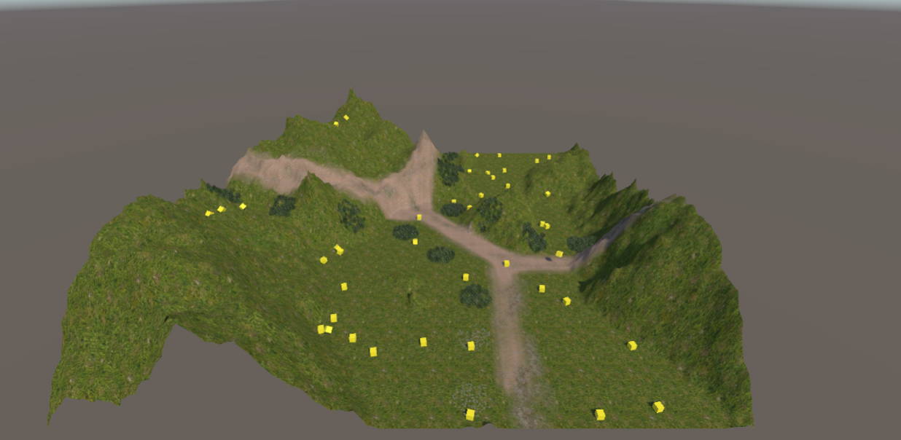

# DiamondSquareAlgorithm-TerrainGeneration

## 📖 Project Overview

This Unity-based project demonstrates terrain generation using the **Diamond-Square Algorithm**, with dynamic prefab spawning. Users can generate new terrains by pressing the spacebar, and the system simulates physics-driven spawning of "food objects" (represented as yellow cubes) above the generated terrain.

---

## 🧠 Key Features

✔️ Procedural terrain generation using Diamond-Square Algorithm  
✔️ Spacebar key interaction to generate a new terrain  
✔️ Physics-based food spawning:  
  - Spawns food items (yellow cubes) every 2 seconds  
  - 10 food items per batch  
  - Max limit of 50 food items  
✔️ Visual interaction and real-time debugging via Unity Inspector  

---

## 📁 Project Folder

  The Unity project could not be uploaded as a single zipped folder due to size or platform limitations. Instead, all essential folders and files from the Unity project have been uploaded individually. These include:

- `Assets/` (contains the `Scripts/` folder with `DiamondSquare.cs`)
- `Packages/`
- `ProjectSettings/`
- `.vsconfig`
- `.gitignore`

  This structure mirrors a standard Unity project setup and can be opened directly in Unity. The .gitignore file is placed at the root of the project to ensure Git correctly ignores unnecessary or generated files (like /Library/, /Temp/, and .csproj files).

---

## 🛠️ How to Run the Project

1.Ensure all uploaded folders and files (`Assets/`, `Packages/`, `ProjectSettings/`, `.vsconfig`, .`gitignore`) are placed inside a single parent folder (e.g., `DiamondSquare TerrainGeneration/`).
2. Open Unity Hub.
3. Click `Add Project` or `Open`.
4. Navigate to the folder containing the uploaded files and select it.
5. Unity will open the project — wait for it to load the environment and assets.

6. Press the **play icon** in the Unity Editor to run the project - the food prefabs will start spawning.
7. Press the **spacebar key** to generate new terrains.

---

## 💡 How It Works

# Terrain Generation #

- The core of terrain generation lies in `DiamondSquare.cs`:
- The `Diamond-Square algorithm` starts with randomized corner values.
- Through recursive "diamond" and "square" steps, it smooths the terrain.
- The result is a natural-looking heightmap applied to Unity's terrain object.

# Food Spawning Logic #

In `Update()`:
- Every 2 seconds, the script checks if fewer than 50 food items exist.
- It spawns 10 food items at random XZ positions above the terrain (Y = 100).
- Each item is a prefab and falls due to physics (`Rigidbody` + `Use Gravity`).

---

## 🔍 Code Structure

# `DiamondSquare.cs` Script Summary #

Contains full logic for:
- Generating terrain using a 2D float array.
- Spawning food prefabs.
- Handling user input (spacebar).
- `ExecuteDiamondSquare()` – runs the terrain algorithm.
- `Update()` – handles prefab spawning logic and spacebar detection.
- `Reset()` – initializes corner values for terrain generation.

For detailed code, check the script in:
`Assets/Scripts/DiamondSquare.cs`

---

## 🧱 Unity Project Setup – Inspector Configuration
# 🎯 DiamondSquare Script Requirements #
The `DiamondSquare.cs` script is attached to a `Terrain GameObject` in the scene.

Make sure the following components and properties are configured correctly:

# 1. Terrain GameObject #
- Component: `Terrain`
- Component: `Terrain Collider` ✅ (Required)
- Attached Script: `DiamondSquare.cs`
- Set script fields in Inspector:
  - `Range Reduction Value`: **0.55** (controls terrain smoothness)
  - `Food` (Prefab): Assign a yellow cube prefab here
  - `Max Food`: **50**
  - `Spawn Interval`: **2.0**
- Terrain Data: Should already be assigned through Unity’s Terrain system

# 2. Food Prefab (Yellow Cube) #
- Includes the following components:
  - `Box Collider` ✅ (enables collision detection)
  - `Rigidbody` ✅ (enable gravity)
    - Make sure **Use Gravity** is checked

# 3. Scene Setup #
- Place the **Terrain** object at origin (0,0,0)
- Ensure the **Food prefab** is stored in the `Assets/Prefabs/` folder (or similar)
- Assign the Food prefab to the **food field** in the **Inspector of Terrain GameObject** (drag & drop)

---

## 🧠 Code Summary

The main logic resides in:  
`Assets/Scripts/DiamondSquare.cs`

### 🗺️ Terrain Generation
- Runs **Diamond-Square Algorithm**
- Assigns random heights to corners
- Recalculates midpoints recursively to create a natural landscape

### 🍽️ Food Spawning
- Spawns 10 prefabs every 2 seconds until 50 max
- Spawns above terrain (Y = 100), falls due to gravity
- Debug message shown when max is reached

Press **Spacebar** at any time to generate a fresh terrain.

---

## 📸 Screenshots
- screenshot of terrain and prefab spawning:

---

## 💿 Software

- Unity (Recommended version: Unity 2021.3+)
- Visual Studio or any C# IDE

---

## 🙋‍♂️ Author

**Aobakwe Bogatsu**  
Computer Systems Engineering Student

